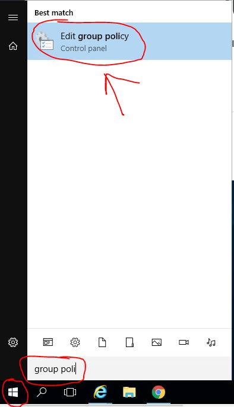
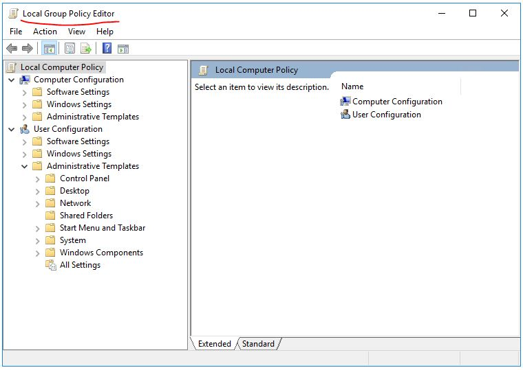
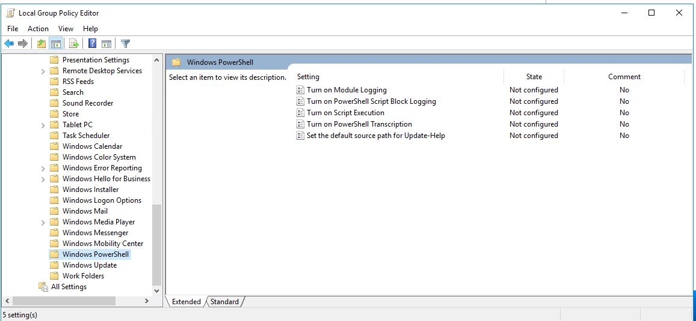
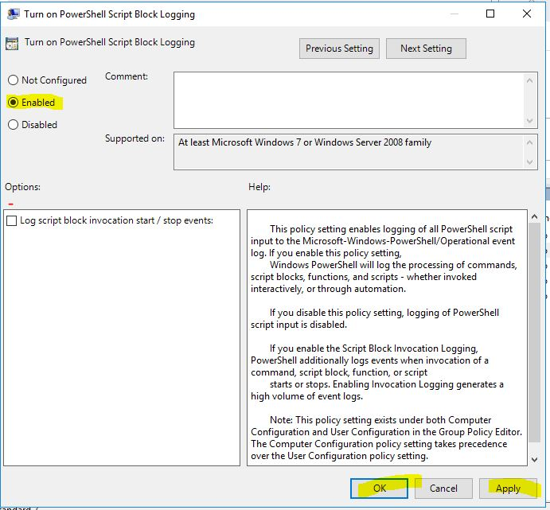
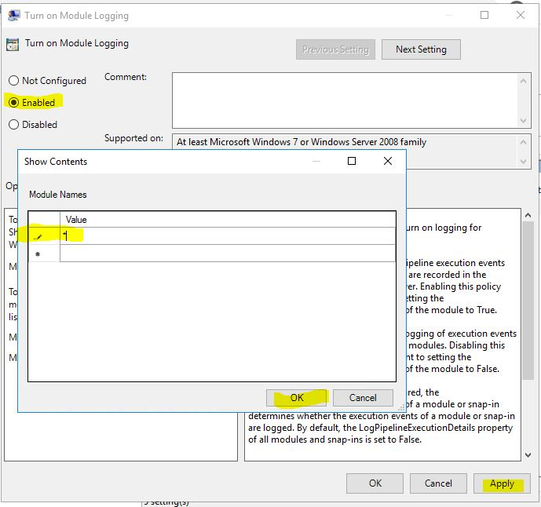

# Threat-Hunting-using-Powershell-Logs

PowerShell supports three types of logging: 
   * Module logging
   * Script block logging
   * Transcription

PowerShell events are written to the PowerShell operational log Microsoft-Windows-PowerShell%4Operational.evtx.

To enable powershell logging

* Click on start button, search for edit group policy and click on edit group policy.

* Local Group Policy Editor window opens.

* Administrative Templates -> Windows Components -> Windows PowerShell

or by using SCCM/AD we can push the changes to entire organization.

To enable script block logging:

1.     In the “Windows PowerShell” GPO settings, set “Turn on PowerShell Script Block Logging” to enabled.

Alternately, setting the following registry value will enable logging:

»      HKLM\SOFTWARE\Wow6432Node\Policies\Microsoft\Windows\PowerShell\ScriptBlockLogging → EnableScriptBlockLogging = 1

To enable module logging:

1.     In the “Windows PowerShell” GPO settings, set “Turn on Module Logging” to enabled.
2.     In the “Options” pane, click the button to show Module Name.
3.     In the Module Names window, enter * to record all modules.
    a.     Optional: To log only specific modules, specify them here. (Note: this is not recommended.)
4.     Click “OK” in the “Module Names” Window.
5.     Click “OK” in the “Module Logging” Window.

Alternately, setting the following registry values will have the same effect:

»      HKLM\SOFTWARE\Wow6432Node\Policies\Microsoft\Windows\PowerShell\ModuleLogging → EnableModuleLogging = 1
»      HKLM\SOFTWARE\Wow6432Node\Policies\Microsoft\Windows\PowerShell\ModuleLogging \ModuleNames → * = *

Script block logging : logs the complete script that is executed. Gets logged into PowerShell operational logs with Event ID 4104

Module logging : Module logging records pipeline execution details as PowerShell executes, including variable initialization and command invocations. Module logging will record portions of scripts, some de-obfuscated code, and some data formatted for output. Module logging events are written to Event ID (EID) 4103.

module logging comes really handy to identify when modules/cmdlets are invoked when the parent script is obfuscated/encoded. we can create use cases based on events that indicate invocation of  modules that are frequently employed by malicious actors.

Transcription : logs the executed script along with the input, output details and environment variables. Each execution logged as a .txt file in the local file system. While this a great data we think it can be overkill given we have substantial coverage with other two logs.
